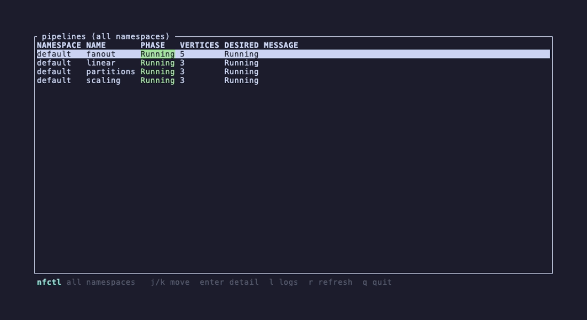
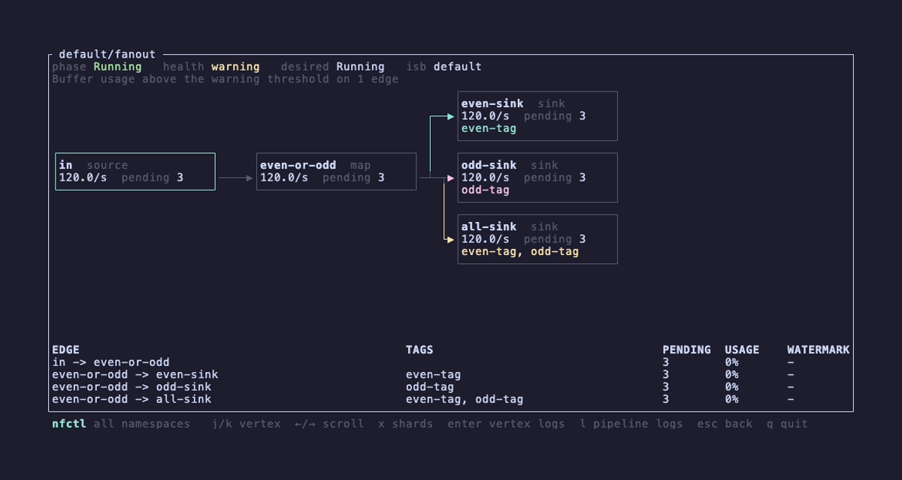
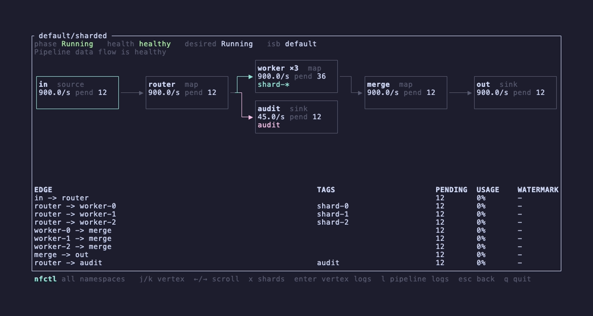
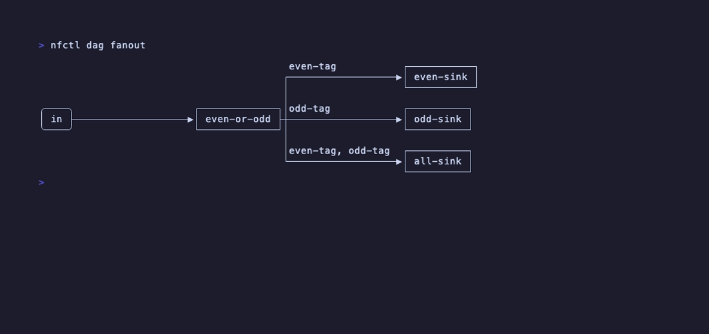
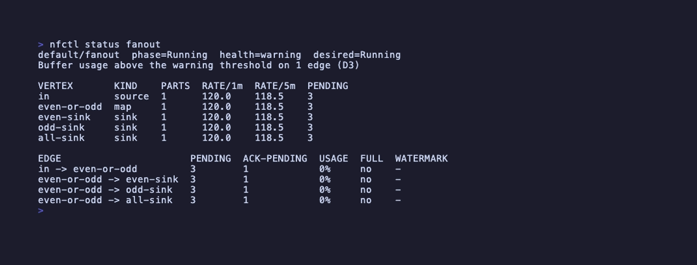

# nfctl

A CLI and TUI for operating [Numaflow](https://numaflow.numaproj.io/) pipelines.

`kubectl` can create and patch Numaflow resources, but it cannot follow a vertex's
logs through pod churn, show buffer fill and processing rates next to the pipeline
phase, draw the DAG, or run a safe pause → drain → resume. `nfctl` does those
things in one static binary, with machine-readable output for command results and
`--dry-run` on every mutating one. Streaming `-o json` is NDJSON: one complete
JSON object per line.

> Status: pre-alpha. Commands below work against Numaflow 1.6+. ServingPipeline is
> not covered yet; see [docs/roadmap.md](docs/roadmap.md).

## Commands

```
nfctl ls                                  pipelines and MonoVertices, with a KIND column (-A for all)
nfctl get <name> [-o wide|json|yaml]      either kind, resolved by name
nfctl dag <pipeline> [-f ascii|mermaid|dot] [--expand-shards]
nfctl logs <pipeline> [vertex] [-f] [-c container] [--since 10m] [--tail N]
nfctl status <pipeline>                   phase + health + rates + pending + buffer usage
nfctl top <pipeline> [-i 2]               the same, refreshing
nfctl isb ls | isb inspect <name>
nfctl pause <pipeline> [--wait]           reports whether buffers drained
nfctl resume <pipeline> [--strategy fast|slow]
nfctl recycle <pipeline> [vertex]         restart a vertex's pods one at a time, or pause-drain-resume
nfctl wait <pipeline> --phase paused
nfctl scale <pipeline> <vertex> <n>
nfctl apply -f spec.yaml [--check]        refuses changes that need delete-and-recreate
nfctl mvtx status|logs|pause|resume       MonoVertex verbs not yet unified (see ADR 0009)
nfctl tui                                 the same, interactive
nfctl completions <shell>                 tab-completes resource names from the cluster
nfctl map                                 every command and option as one tree
```

Global flags: `-n/--namespace`, `--context`, `--request-timeout`, `-o`, `--daemon-url`
(skip the port-forward when running in-cluster), `--fixture` (no cluster at all),
`--no-color` (`NO_COLOR` in the environment does the same).

Without `-n`, lists span every namespace and a bare name resolves to the namespace
it lives in; the tool refuses only when the same name exists in several. `get`
resolves across kinds too, so it also refuses a name a Pipeline and a MonoVertex
both carry — the error names each candidate's kind.

### `dag`

```
                                                ┌───────────┐
                                             ┌─▶│ even-sink │
                                             │  └───────────┘
           ┌─────────────┐                   │
┌────┐     │ even-or-odd │─even-tag──────────┘  ┌───────────┐
│ in │────▶│             │─odd-tag─────────────▶│ odd-sink  │
└────┘     │             │─even-tag, odd-tag─┐  └───────────┘
           └─────────────┘                   │
                                             │  ┌───────────┐
                                             └─▶│ all-sink  │
                                                └───────────┘
```

Shards (`worker-0`, `worker-1`, ... with the same neighbours) draw as one
`worker ×N` node unless `--expand-shards`. On a terminal, edges that carry tag
conditions are coloured by tag combination: every edge with the same set of tags
shares a hue, untagged edges are dim. The TUI does the same, and adds the tags
as a badge row on the card they arrive at:

```
┌───────────────┐     ┌───────────────┐     ┌───────────────┐     ┌───────────────┐     ┌───────────────┐
│in  source     │────▶│router  map    │──┬─▶│worker ×3  map │────▶│merge  map     │────▶│out  sink      │
│900.0/s pend 12│     │900.0/s pend 12│  │  │900.0/s pend 36│     │900.0/s pend 12│     │900.0/s pend 12│
└───────────────┘     └───────────────┘  │  │shard-*        │     └───────────────┘     └───────────────┘
                                         │  └───────────────┘
                                         │  ┌───────────────┐
                                         └─▶│audit  sink    │
                                            │45.0/s pend 12 │
                                            │audit          │
                                            └───────────────┘
```

### `status`

```
default/linear  phase=Running  health=healthy  desired=Running
Pipeline data flow is healthy (D1)

VERTEX  KIND    PARTS  RATE/1m  RATE/5m  PENDING
in      source  1      5.0      5.0      -
cat     map     1      5.0      5.0      4
out     sink    1      4.9      5.0      9

EDGE        PENDING  ACK-PENDING  USAGE  FULL  WATERMARK
in -> cat   0        6            0%     no    1s ago
cat -> out  0        10           0%     no    2s ago
```

Runtime numbers come from the pipeline's daemon, reached through an automatic
port-forward; if the daemon is unreachable the CRD half still renders with a warning.

## Install

```
brew install txmxthy/tap/nfctl
```

Prebuilt archives for macOS and Linux are attached to each
[GitHub release](https://github.com/txmxthy/nfctl/releases). To build from a
checkout instead, run `cargo install --path crates/nfctl-cli`.

Shell completion is dynamic: it completes pipeline, vertex, MonoVertex, ISB and
namespace names from the cluster you are pointed at (or from `--fixture`), with a
30-second cache so repeated Tabs are instant. Register it in your shell's startup
file, once per shell start:

```
nfctl completions fish | source                        # fish
source <(nfctl completions bash)                       # bash
source <(nfctl completions zsh)                        # zsh
nfctl completions elvish | eval                        # elvish
nfctl completions powershell | Out-String | Invoke-Expression   # powershell
```

The snippet calls `nfctl` on each Tab; a cluster that does not answer within
1.5 s completes from the last cache, or nothing.

## Demo

Every command also runs against a fixture file instead of a cluster:

```
nfctl --fixture examples/fixtures/demo.yaml tui
```

The same fixture drives the golden-frame tests, the recordings below and the
stills used to review layout, so what is tested is what is shown.

| | |
|---|---|
|  |  |
|  |  |
|  | |

Animated: [tui](docs/demo/tui.gif) · [ls](docs/demo/ls.gif) · [logs through a pod
restart](docs/demo/logs.gif) · [top](docs/demo/top.gif) · [pause and resume](docs/demo/pause.gif)
· [apply --check](docs/demo/apply.gif) · [recycle](docs/demo/recycle.gif)

`just gallery` renders every fixture pipeline through the card view and `dag`
into one HTML page you can draw on; see [CONTRIBUTING](CONTRIBUTING.md#looking-at-layouts).

`just demo-up` installs Numaflow into your current local kube context and applies
the pipelines in [`examples/`](examples); [`docs/demo`](docs/demo) has the tapes
(`just record-fixture` renders the cluster-free ones).

## Design

Hexagonal. A pure domain crate with two ports (cluster, daemon), thin adapters for
kube-rs and the daemon's JSON API, and a CLI on top. See
[docs/architecture.md](docs/architecture.md) and the ADRs in [docs/adr](docs/adr).

Operators should review the [RBAC and transport boundary](docs/operator-security.md).
Security vulnerabilities should be reported through the private process in
[SECURITY.md](SECURITY.md), not a public issue.

## Development

```
just ci          # fmt, clippy -D warnings, tests, cargo-deny
just test-live   # tests that need the demo cluster
```

## Licence

Apache-2.0. The box-drawing output is drawn by the orthodag crate (MIT OR
Apache-2.0).
