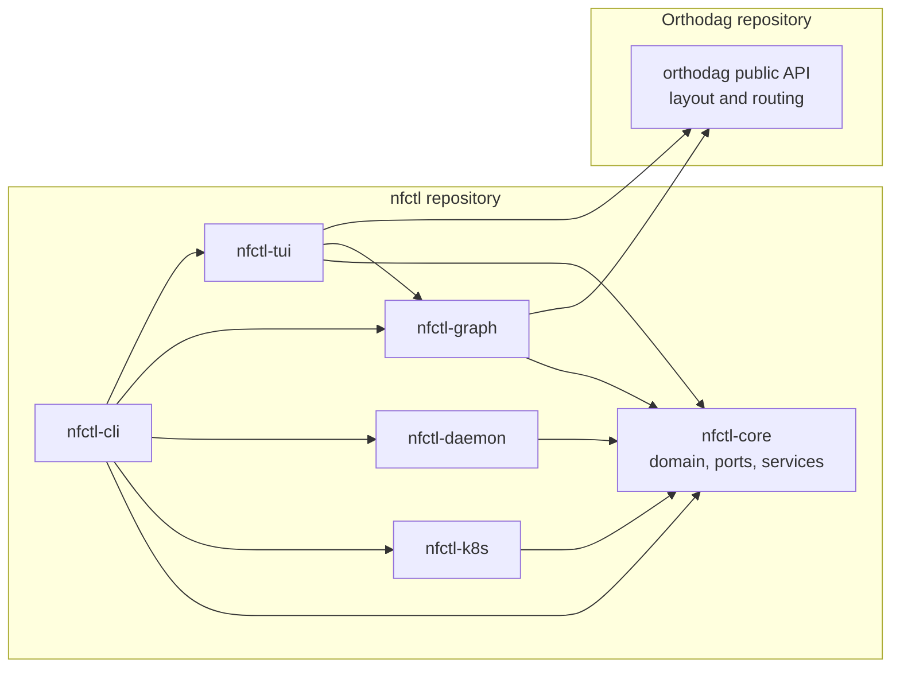

# Architecture

## Compile-time dependencies

Arrows are direct, normal Cargo dependencies, not runtime calls; dev-dependencies are
excluded. This is hexagonal architecture (ports and adapters): `nfctl-core` is the
inner hexagon, while the binary, presentations and infrastructure adapters depend inward.

`nfctl-cli` is the binary and composition root, so it compiles the core, both adapters
and both presentation crates. `nfctl-core` owns the domain model, ports and use cases.
`nfctl-k8s` and `nfctl-daemon` own protocol DTOs and implement core ports. `nfctl-graph`
owns topology-to-diagram projection; `nfctl-tui` owns interactive state and terminal
presentation.

Orthodag is a separate repository and general-purpose layout crate. `nfctl-graph` and
`nfctl-tui` cross that repository boundary through Orthodag's public Rust API; core does
not. It is a registry dependency, pinned by version in each manifest.

## Ports

| Port | Owner | Implemented by | Purpose |
|---|---|---|---|
| `ClusterPort` | core | `nfctl-k8s` | list/watch CRDs, patch lifecycle, pods, logs |
| `DaemonPort` | core | `nfctl-daemon` | buffers, rates, pending, watermarks, health |
| `DaemonConnector` | core | `nfctl-daemon` | abstract factory: one `DaemonPort` per pipeline |

Only these vary between environments, so only these are abstracted. Config, clock and
terminal are used directly.

## Services

`PipelineService` composes the two ports and owns every multi-step procedure
(`status` fusion, `pause` with drain wait, `recycle`, `check_apply`). `LogTailer`
supervises one tail per (pod, container) under a pod watch so output survives
scale-to-zero. Both are tested against in-memory fake adapters.

## Data flow for `nfctl top`

1. `ClusterPort::get_pipeline` → domain `Pipeline` (validated `Topology`).
2. `DaemonConnector::connect` → `DaemonPort` bound to that pipeline, kept for
   as long as the process runs. Reaching a daemon means finding its pod,
   opening a port-forward and a TLS handshake, which costs more than every
   question that follows; a kept client also keeps its connection pool.
3. `DaemonPort::health/vertex_metrics/buffers/watermarks`, asked together →
   joined per vertex and edge.
4. Renderer prints a table or JSON. Daemon failure degrades to the CRD-only view with a warning.

## How often the numbers are asked for

The shape of a pipeline is one call to the Kubernetes API, so it is fetched on
every refresh and drawn as soon as it lands. The numbers are not uniform:

| Answer | Calls | Asked |
|---|---|---|
| health, buffers, watermarks | one each | every refresh (`--interval`, 2 s) |
| vertex metrics | **one per vertex** | at most every 5 s |

Numaflow's pipeline daemon has no endpoint for every vertex at once
(`GetVertexMetrics` takes one vertex name), so metrics cost one round trip per
vertex: eleven of them on a middling pipeline, which on a cluster across an
ocean is seconds. Everything else is a single call, so metrics alone are asked
for on a slower clock, `METRICS_TTL` in `nfctl-daemon`.

Five seconds costs a reader nothing. The rates are already averages over one,
five and fifteen minutes, so a two-second refresh redrew identical numbers;
pending is a gauge, and being five seconds behind on a queue depth changes no
decision anyone makes from this tool.

Numaflow's UI server does expose one endpoint for all of them,
`/namespaces/{ns}/pipelines/{p}/vertices/metrics`, and it was considered. It is
a separate deployment that may not be installed, can have its own
authentication in front of it, and its handler only loops over the same
per-vertex daemon call from inside the cluster. Using it would take this tool
from two dependencies, the Kubernetes API and a pipeline's own daemon, to
three, in exchange for latency that a slower clock buys for nothing.

Fetching the vertices concurrently was tried and reverted: each concurrent call
wants its own connection, a connection here is a port-forward, and opening them
cost more than the round trips saved.

## One fixture, three consumers

`examples/fixtures/demo.yaml` is a serialised slice of the domain: pipelines,
MonoVertices, ISB services, per-pipeline daemon data and pods with log lines.
`nfctl --fixture FILE` runs any command against in-memory fakes built from it.
The TUI's golden-frame tests (`crates/nfctl-tui/tests/frames.rs`, ratatui
`TestBackend` + `insta`) render the panels from the same file, and the vhs tapes
under `docs/demo/` that set `NFCTL_FIXTURE` record the same screens as GIFs and
PNGs. Changing the fixture changes all three together.

## Drawing a pipeline

`nfctl-graph` owns every picture. The Mermaid and DOT emitters are pure functions
of the topology. Both pictures of a pipeline start from a `ViewGraph`, which is
the topology with shard groups (`name-0..name-N` with identical neighbourhoods)
collapsed to one node, and both are laid out by orthodag (ADR 0004): the
box-drawing `dag` output is its text, coloured from its styled spans, and the
TUI's card view reads its boxes and polylines back and paints the cards itself.
Edge colour is orthodag's palette slot per tag combination; the TUI painter and
the CLI's ANSI writer only map a slot to a hue. The card layout this replaced is
ADR 0006; completions are ADR 0007. How cells, colours and tracks turn into glyphs is in [rendering.md](rendering.md).

## Completions

`nfctl` completes its own resource names. The shell snippet from
`nfctl completions <shell>` calls the binary back with `COMPLETE=<shell>` and the
line so far; `main` answers that before anything else runs. Each positional has
a completer in `crates/nfctl-cli/src/complete.rs` that reads the line
(`--context`, `-n`, `--fixture`, the pipeline already typed) and asks a catalog
built from the fixture, a cache under `$XDG_CACHE_HOME/nfctl` younger than 30 s,
or one cluster round-trip bounded to 1.5 s. A completer cannot report errors, so
every failure degrades to the stale cache or an empty list. A context that
authenticates through a credential plugin can print its own errors from a child
process, so the lookup runs with this process's stdin and stderr pointed at
`/dev/null`: a Tab press writes candidates or nothing (ADR 0008). Running a
command normally still reports the plugin's message.
